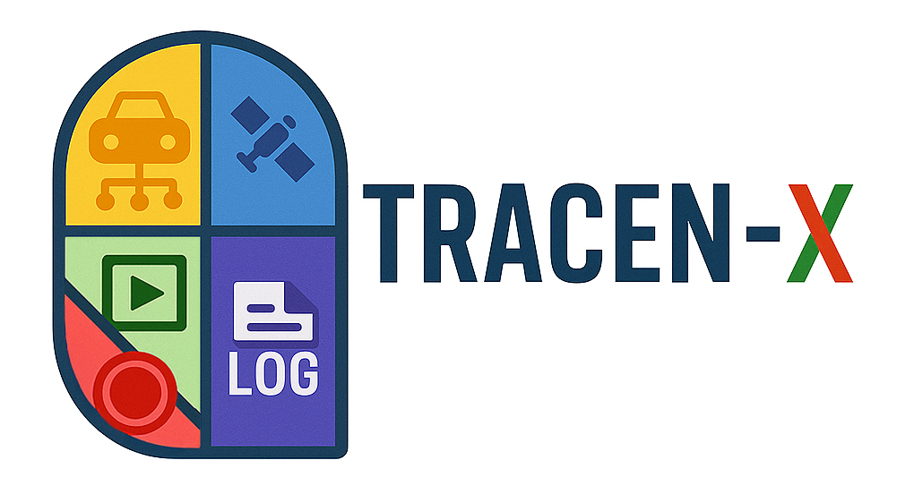

# TRACEN-X: Telemetry Replay and Analysis of CAN bus and External Navigation data

<div align="center">


  
</div>

<br/><br/>

## Authors
- **Diego Gasco** - Politecnico di Torino - diego.gasco@polito.it (diego.gasco99@gmail.com)
- **Carlos Mateo Risma Carletti** - Politecnico di Torino - carlos.rismacarletti@polito.it
- **Francesco Raviglione** - Politecnico di Torino - francesco.raviglione@polito.it
- **Marco Rapelli** - Politecnico di Torino - marco.rapelli@polito.it
- **Claudio Casetti** - Politecnico di Torino - claudio.casetti@polito.it

## Description

TRACEN-X is a Python-based project that provides tools to record data from field tests of vehicles and vulnerable road users and replay it in a controlled environment, such as a laboratory. This digital twin of field tests allow to analyze and validate new solutions for vehicle navigation and communication systems, including GNSS receivers, CAN Bus sensors, and V2X messages.

The supported data sources to a field test recreation include:
- Serial Device for the positioning (GNSS receiver) of the Ego vehicle.
- CAN Bus for the on-board sensors of the Ego vehicle.
- V2X messages received by the Ego vehicle from other CAVs and VRUs.

With TRACEN-X, each one of these data sources can be recorded and saved with a specific script, and then replayed in real-time to emulate the original conditions of the field test.
The project also includes a GUI to visualize the vehicle and the objects perceived during the replay phase.

### GNSS Data
The GNSS data is recorded from a serial device (e.g., a GNSS receiver) and saved in JSON format. The data includes timing information to ensure accurate replay. The serial device can be emulated using socat, allowing for flexible testing without needing the actual hardware. The GNSS data is reproduced in real-time through a virtual serial device, which can be used by the On Board Unit (OBU) of the Ego vehicle to receive the positioning data, just as it would in a real-world deployment. The OBU can then use this data for navigation and communication purposes.

### CAN Bus Data
The CAN Bus data is recorded from the vehicle's on-board sensors and saved in JSON format. The data includes timing information and can be replayed in real-time through a virtual CAN Bus interface.
For both recording and replaying, the CAN Database file is needed to decode and encode the CAN messages properly. The CAN Database can be provided in DBC format.
The CAN Bus data represents the on-board sensors used by the Ego vehicle to perceive its surroundings.

### V2X Messages
The V2X messages are recorded from the vehicle's communication system and saved in PCAP format. The data can be replayed in real-time through a network interface. The V2X messages are essential for reproducing the messages received by the Ego vehicle from other CAVs and VRUs during the field test. The network interface can be used by the OBU of the Ego vehicle to send and receive V2X messages, just as it would in a real-world deployment.

### Scripts Overview

The project consists of three main scripts: `record/record.py`, `replay/replay.py`, and `merge_traces/union.py`.

The `record` script captures data from one or multiple data sources and save the content with timing information in JSON and PCAP formats (depending on the data source).

The `replay` script reads the stored files and emulates the data sources in real-time, through a virtual serial device, a virtual CAN Bus, and a network interface. The option for displaying a Web GUI for visualization is useful to have a direct view on the reproduction.
To reproduce the behavior of the original CAV, the virtual serial device and the virtual CAN Bus can be used as data sources for the On Board Unit (OBU) of the Ego vehicle, so that the field test can be repeated as often as needed without the need to be phisically on the road. The OBU can then use the network interface mentioned above to send (using the OBU itself) and receive (through TRACEN-X reproduction) V2X messages, just as it would in a real-world deployment. It is also possible to send the reproduced V2X messages to an AMQP broker, allowing for further processing or analysis of the data.
For more details on OBU integration within this replay setup, refer to [OScar](https://github.com/DriveX-devs/OScar).

Combined with the `replay` feature that saves positioning data to a CSV file, the `merge_traces` script enables the consolidation of multiple CSV traces into a single, unified file. This is particularly useful for reproducing complex scenarios involving multiple vehicles and vulnerable road users (VRUs) within a simulator that supports CSV-based input for mobility and V2X communication playback. For more details on Simulation reproduction of CSV traces, refer to `gps-tc` functionality of [VaN3Twin](https://github.com/DriveX-devs/VaN3Twin).

## Requirements

### Software Requirements
- Linux-based operating system (e.g., Ubuntu, Debian, etc.)
- Python 3.9 or higher
- socat (for serial emulation)
- [Optional] can-utils (for testing CAN Bus features with `canplayer` and `candump` functionalities)

### Usage of sudo
The majority of functionalities could be used without `sudo`.

However, in order to perform V2X message replay on a real network interface, root permissions are required due to the need for writing to raw sockets.

For consistency and to avoid unexpected permission issues, we conventionally run all commands with `sudo`.

### Python Packages
- pyserial (for serial recording and reproducing)
- pyproj (for GUI mode)
- nodejs (for GUI mode), version v12.22.9 or higher
- cantools (for CAN Bus recording and reproducing)
- asn1tools (for V2X messages parsing and encoding)
- scapy (for V2X messages recording and reproducing)
- python-qpid-proton (for V2X messages sending to an AMQP broker)

## Installation

1. Clone the repository:
    ```sh
    git clone https://github.com/DriveX-devs/TRACEN-X.git
    cd TRACEN-X
    ```
    
2. Upgrade pip and install Python development headers for the used version
    ```sh
    sudo python3 -m pip install --upgrade pip
    sudo apt install python3.<version-used>-dev
    ```
    
3. [Optional] Set environmental variable for embedded systems (e.g. On Board Units) to work correctly with cantools package:
    ```sh
    MSGPACK_PUREPYTHON=1 pip3 install --no-cache-dir cantools
    ```
    
4. Install the required Python packages:
   ```sh
    sudo pip install -r requirements
   ```
   
5. [Optional] Install the required Python packages:
    ```sh
    sudo pip install pyserial
    sudo pip install cantools
    sudo pip install pyproj
    sudo pip install asn1tools
    sudo pip install scapy
    sudo pip install python-qpid-proton
    ```

6. Ensure `socat` is installed on your system:
    ```sh
    sudo apt-get install socat
    ```

7. Ensure `nodejs` is installed on your system (**IMPORTANT**: ensure to have at least v12.22.9); if you have an older version, you need to upgrade it manually following the instructions available [here](https://nodejs.org/en/download/).
    ```sh
    sudo apt install nodejs
    ```

8. Install the npm packages for nodejs GUI:
    ```sh
    cd replay/vehicle_visualizer
    sudo npm install
    ```

9. Prepare the virtual CAN Bus for the emulation:
    ```sh
    sudo ip link add dev vcan0 type vcan
    sudo ip link set up vcan0       
    ```

10. [Optional] Install the can-utils packages (just if you want to test with `canplayer` and `candump`):
    ```sh
    sudo apt install can-utils
    ```

## Usage

There are many parameters that can be set for each script, depending on the data you want to record or reproduce. The scripts are designed to be flexible and allow for various configurations.
The detailed usage of each script can be found by running the following commands to display the help messages:
```sh
sudo python3 record/record.py --help
sudo python3 replay/replay.py --help
sudo python3 merge_traces/union.py --help
```

A detailed description of the parameters and their usage is provided in the help messages of each script.

### Record

Example of usage for the `record` script:
```sh
sudo python3 record/record.py --enable-serial --device /dev/ttyACM0 --serial-filename ./data/outlog.json --baudrate 115200 --end-time 10 --enable-CAN --CAN-device vcan0 --CAN-filename ./data/CANlog.json --CAN-db ./data/motohawk.db --enable-pcap --interface wlan1 --pcap-filename ./data/pcap_output/trace2.pcapng
```

### Replay

Example of usage for the `replay` script:
```sh
sudo python3 replay/replay.py --enable-serial --serial-filename ./data/gnss_output/example1.json --server-device ./replay/ttyNewServer --client-device ./replay/ttyNewClient --baudrate 115200 --start-time 0 --end-time 10 --enable-gui --http-port 8080 --enable-pcap --interface wlan1 --update-datetime --new-pcap-file new_pcap.pcapng --enable-amqp --amqp-server-ip 127.0.0.1 --amqp-server-port 5672 --amqp-topic tracenx --enable-CAN --CAN-device vcan0 --CAN-filename ./data/CANlog.json --CAN-db ./data/motohawk.db --enable-csv --csv-filename ./data/gnss_output/example1.csv --csv-interpolation
```

### Merge Traces

Example of usage for the `merge_traces` script:
```sh
sudo python merge_traces/union.py --csv-files trace1.csv trace2.csv trace3.csv --output merged.csv --file-reference trace1.csv
```

Follow the instructions inside the script to select the desired options.

## Work in Progress
- [ ] Enable the reliable usage of baud rates higher than 115200
- [ ] Enable GUI for V2X messages received, VAMs and DENMs
- [X] Enable GUI for V2X messages received, CAMs and CPMs (objects perceived)
- [X] Enable AMQP subsciption and publishing of V2X messages
- [X] Enable V2X messages reproduction with updated time-related information
- [X] CAM, VAM, CPM, DENM parsing
- [X] Enable the GUI reproduction of diverse objects perceived through the CAN Bus
- [X] Make the record script more robust to issues that may stop the recording of the trace, making it save anyway what has been captured until that moment
- [X] CAN Database recording and reproduction
- [X] Serial Device recording and reproduction
- [X] V2X messages recording and reproduction
- [X] CSV traces creation and merging
- [X] Enable V2X messages reproduction with updated security certificates
